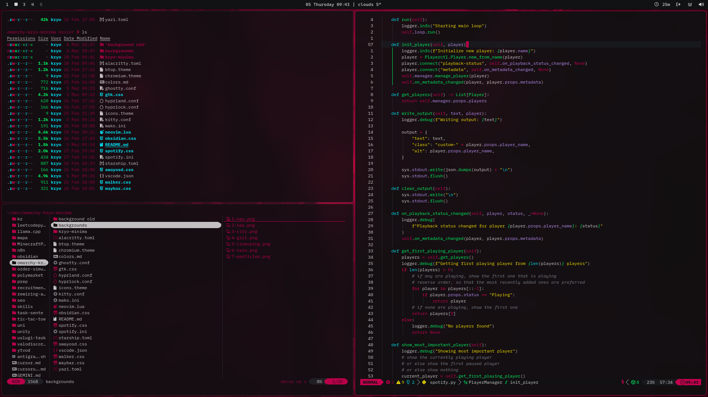
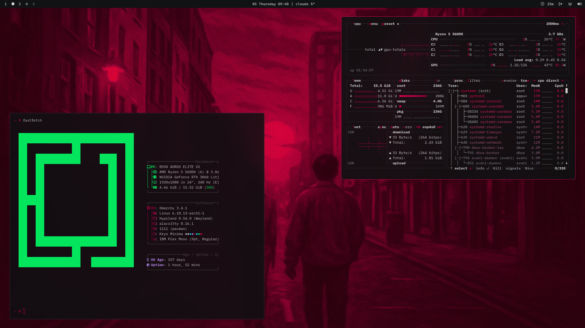
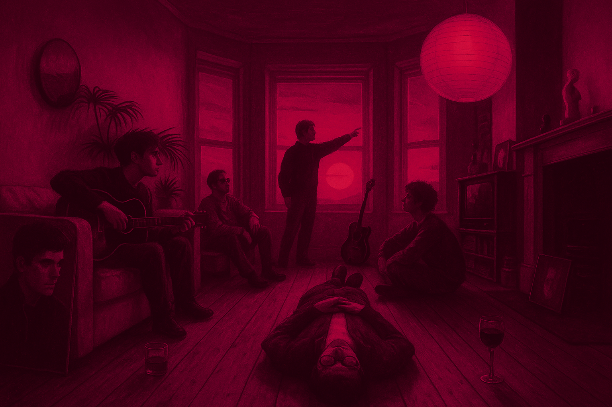
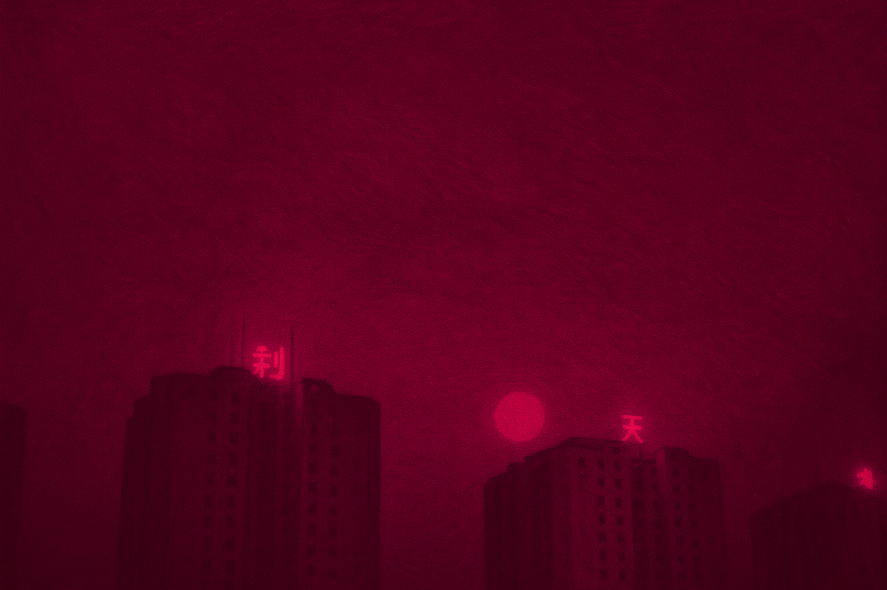
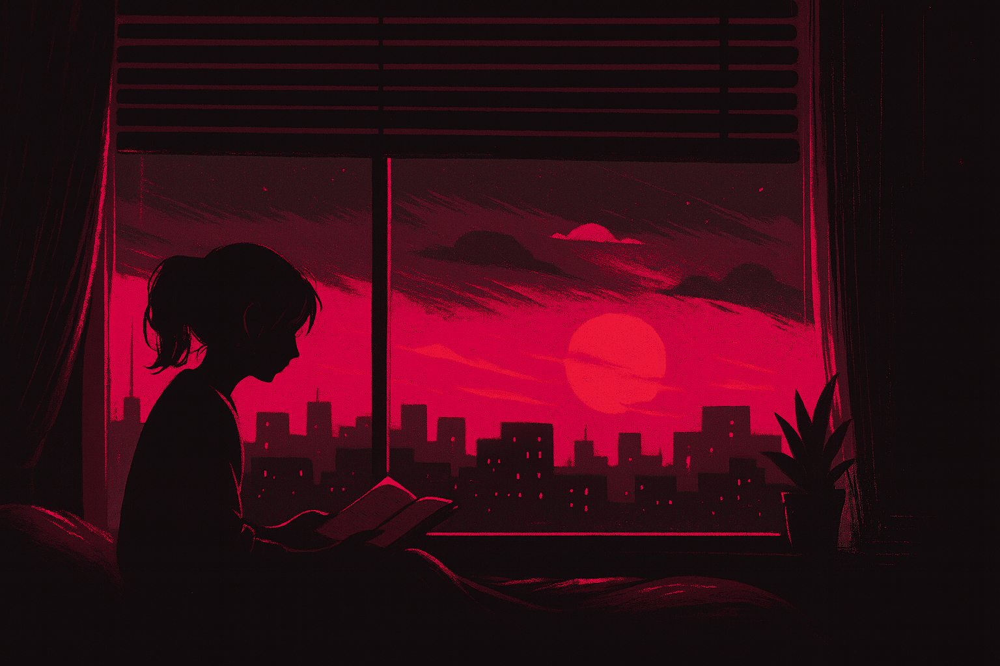
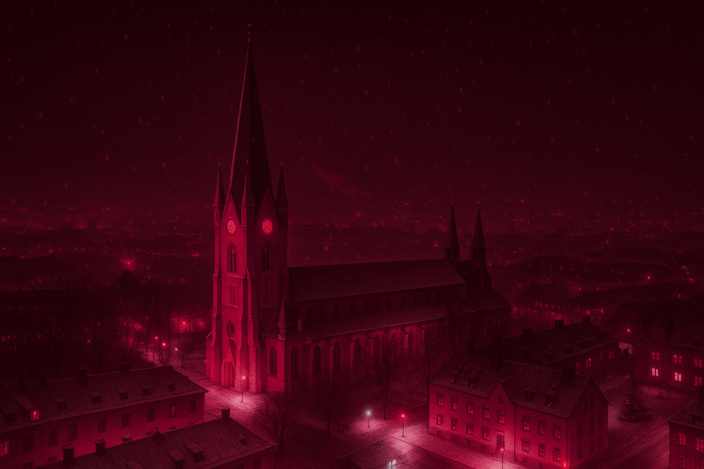
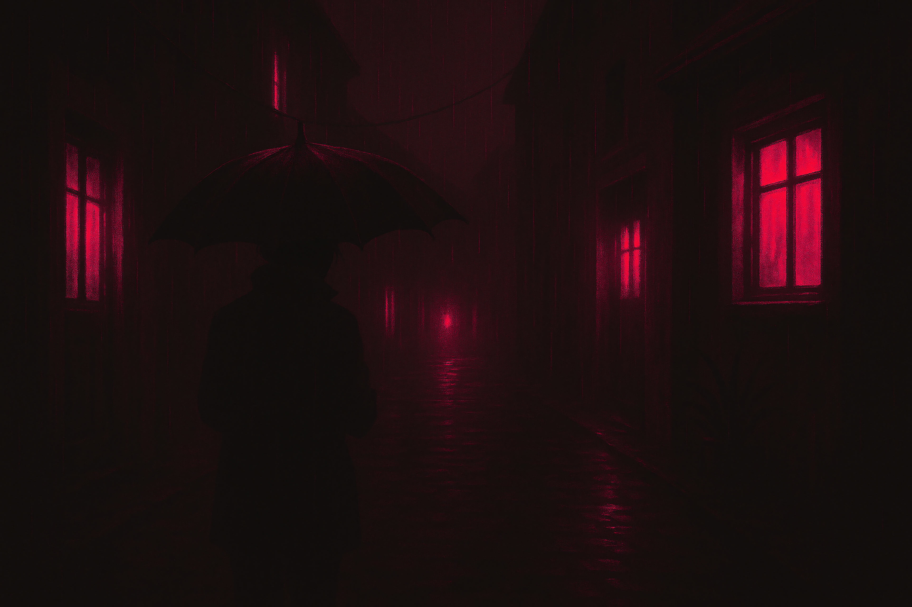

# kryo-minima

A Dark Crimson minimalistic theme for [Omarchy](https://omarchy.org)

## Showcase

 

### Backgrounds

   

  

## Installation

### Command Line

```bash
omarchy-theme-install https://github.com/kryo1337/omarchy-kryo-minima
```

### Omarchy Menu

1. Open Omarchy menu
2. Navigate to **Install > Style > Theme**
3. Use the following link:

   ```
   https://github.com/kryo1337/omarchy-kryo-minima
   ```

## Auto-Applied

These are applied automatically by `omarchy-theme-set`:

- Hyprland (hyprland.conf, hyprlock.conf), Waybar, Walker, SwayOSD, Mako
- Alacritty, Kitty, Ghostty
- btop, Obsidian, VS Code (theme only), Chromium
- Icon theme

## Post-Install

### Setup

```bash
cp ~/.config/omarchy/themes/kryo-minima/neovim.lua ~/.config/nvim/lua/plugins/theme.lua
cp ~/.config/omarchy/themes/kryo-minima/starship.toml ~/.config/starship.toml
cp ~/.config/omarchy/themes/kryo-minima/yazi.toml ~/.config/yazi/theme.toml
```

### Firefox

Install from [addons.mozilla.org](https://addons.mozilla.org/en-US/firefox/addon/kryo-minima/)

### Spicetify

```bash
mkdir -p ~/.config/spicetify/Themes/kryo-minima
cp ~/.config/omarchy/themes/kryo-minima/spotify.ini ~/.config/spicetify/Themes/kryo-minima/color.ini
cp ~/.config/omarchy/themes/kryo-minima/spotify.css ~/.config/spicetify/Themes/kryo-minima/user.css
spicetify config current_theme kryo-minima
spicetify config color_scheme kryo-minima
spicetify apply
```

### VS Code

Theme is auto-set. For full color customizations:

```bash
jq -s '.[0] * (.[1] | del(.name, .extension))' ~/.config/Code/User/settings.json ~/.config/omarchy/themes/kryo-minima/vscode.json > /tmp/vscode-settings.json && mv /tmp/vscode-settings.json ~/.config/Code/User/settings.json
```

## Dotfiles

Check out my [dotfiles](https://github.com/kryo1337/dotfiles) for more configurations and customizations.
